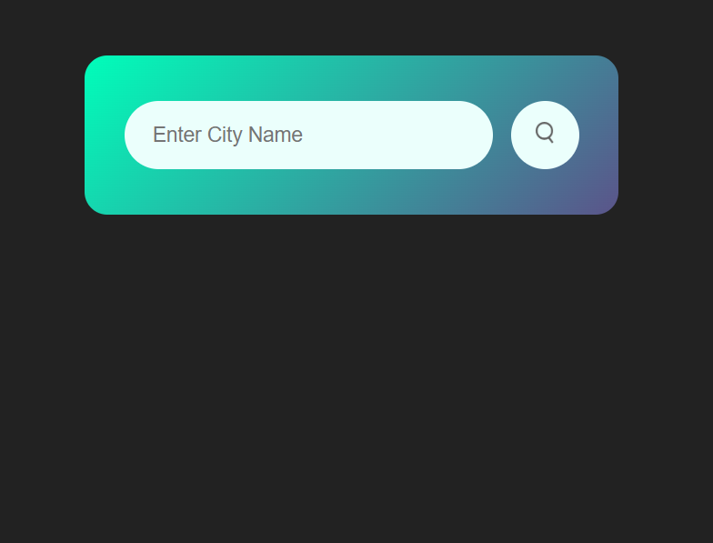
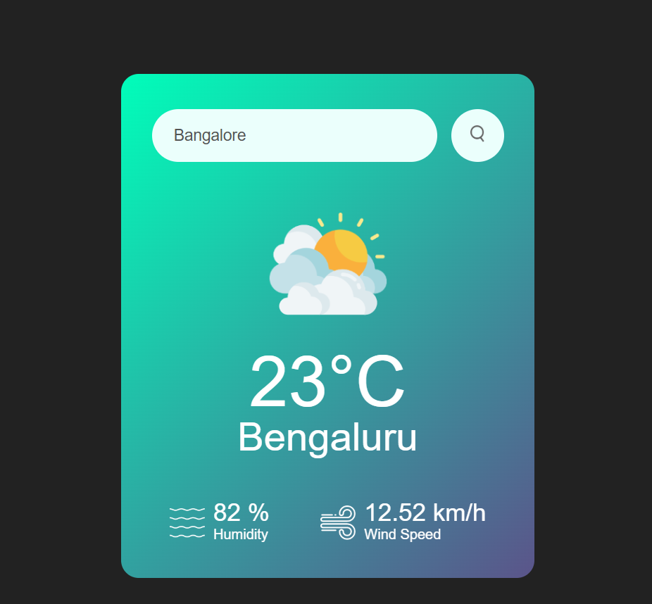
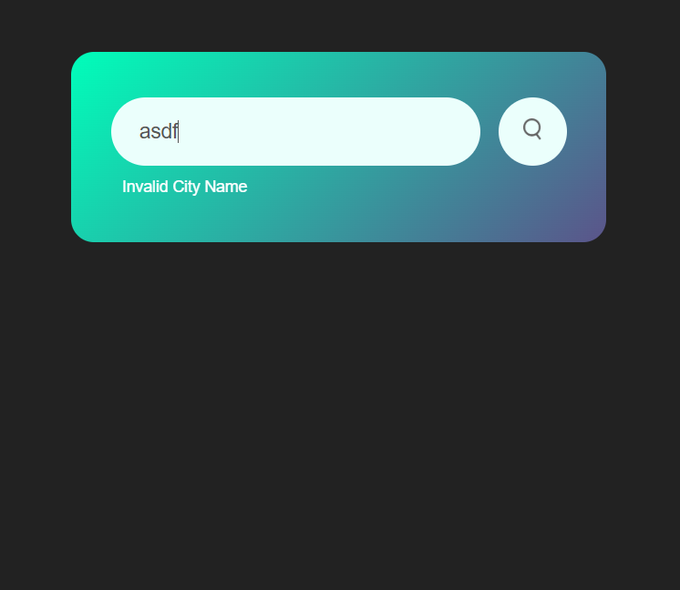

# 🌦️ Weather App

A simple weather application built with **HTML, CSS, and JavaScript** that fetches real-time weather data using the **OpenWeather API**.  

Users can enter a city name to check the **temperature, humidity, and wind speed**.  

---

## 🚀 Features
- Search weather information by **city name**  
- Displays:
  - Current temperature (°C)
  - City name
  - Humidity (%)
  - Wind speed (km/h)
- Shows weather icons dynamically (sun, rain, clouds, etc.)
- Error handling for **invalid city names**
- Responsive and clean UI  

---

## 🖼️ Screenshots

### 🔹 Initial Screen (Search Box Only)


### 🔹 Valid City (Example: Bengaluru)


### 🔹 Invalid City (Error Message)


---

## 🛠️ Built With
- **HTML5** – structure + embedded JavaScript  
- **CSS3** – styling  
- **[OpenWeather API](https://openweathermap.org/)** – weather data  

---

## ⚡ Getting Started

### 1️⃣ Clone the Repository
```bash
git clone https://github.com/your-username/weather-app.git
cd weather-app
```
2️⃣ Get an OpenWeather API Key
- Sign up at OpenWeather

- Generate your API key


3️⃣ Add Your API Key

Open index.html and replace with your API key:
```
const apiKey = "YOUR_API_KEY_HERE";
```
4️⃣ Run the App

Simply open index.html in your browser 🎉
```
📂 Project Structure

weather-app/
│── index.html         # HTML file 
│── style.css          # Stylesheet
│── images/            # Weather icons (search, clouds, sunny, rain, etc.)
│── screenshots/       # App screenshots
│    ├── normal.png
│    ├── valid.png
│    └── invalid.png
```
🙌 Acknowledgements

- Weather data powered by OpenWeather API

- Icons and UI inspired by minimal weather apps